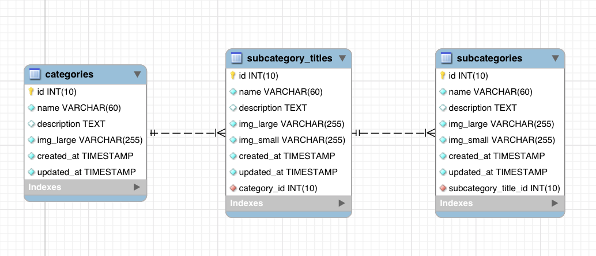
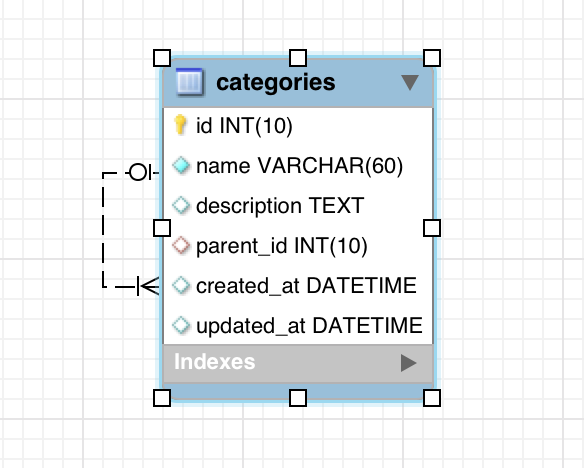

# Belleza Organica
> E-commerce website.

This repository is a production grade e-commerce website that I built for a client of mine. The backend is powered with ExpressJS, and the front-end is powered with ReactJS. The design was inspired by their previous website and improved on for a better user experience. You can view the production version of this website [here](https://bellezaorganica.com.mx/home).

## Table of Content
- [Development](#development)
	- [Database](#database)
	- [Frontend](#frontend)
	- [Backend](#backend)
- [Production](#production)
	- [Security](#security)
	- [Optimization](#optimization)
- [Usage](#usage)
- [Contributing](#contributing)
- [License](#license)


## Development
I split the development process into three different stages. The first stage was to understand how the current data was beginning stored, e.g., SQL, NoSQL. After I had a grasp on my client's data, I began writing the frontend code. I started with the frontend code mostly because I wanted to have something to show. Once I finished the frontend, I started coding up the backend and at the same time made some improvements to the frontend.

### Database
The previous website was using a MySQL database with a simple e-commerce structure. My initial thought was to move the data into a NoSQL database mostly because I like the flexibility of a NoSQL database, but I decided to stick with MySQL. I did make some structural changes to optimize the performance of the database, the biggest of which was as follows.

The previous version used three tables to structure the categories. I thought that this was a bit redundant, so I changed the tables into just one self-referencing table. This way I could use a simple select query to get all the categories at once without having to use joins.

 -> 

### Frontend
For the frontend code, I used what I like to call the **React Stack**, which is ReactJS, Redux, React Router, and ImmutableJS. Along with a bunch of great npm packages, I was able to quickly develop a user-friendly UI. I split my code into two spread parts, Pages, and Components. The main difference between a Page and a Component, with the exception of the Layout and Loader Components, is that a Component is unaware of Redux.

#### Redux Store Structure
I structured the redux store accordingly because each object represents either a single row from a table or a collection of rows from a table.  I organized it like this so that whenever I fetch for a collection of objects, I only have to load the necessary data and not the entire object. For example loading a list of products only loads the product's name, price, and SKU instead of all of the product data.
```
{
	categories: categoriesReducer,
	cart: cartReducer,
	products: productsReducer,
	product: productReducer,
	user: userReducer,
	others: othersReducer,
	codes: codesReducers,
	orders: ordersReducer,
	order: orderReducer,
	clients: clientsReducers,
	client: clientReducers,
	errors: errorsReducer,
	fetching: fetchingReducer
}
```

There are multiple reducer functions for each individual object and I used the reduce-reducers package to combine them into one.

### Backend
For the backend code, I used ExpressJS to handle all the web requests and some rendering. For the view renderer, I used handlebars, but I only use it to render email templates and the initial index.html page. For rendering the actual web app I used React Server Side render, and for handling a user's session, I used JSON Web Tokens (JWT). The ORM that I use to connect to the MySQL database is Sequelize. Sequelize is one of the most popular ORM for NodeJS, and I found it very simple to use.

I structured the backend using the general MVC pattern, and I included middleware, and helpers, kind of like how a Rails app is structured. I used two types of controllers the API controllers and the view controllers. The main difference between these controllers is that one returns a rendered HTML string and the other only returns JSON object.

#### React Server Side
This simple helper function handles all of the React Server Side rendering. The only thing that changes with each request is the data and the URL. The only routes that are rendered with React are the ones found in the view_controllers folder. The one thing that they all have in common is that they are all accessible without a JSON Web Token, if a user tries to access a route where a JWT is required they will be redirect to the home page.

```
module.exports = function (promises, map, url) {
	return Promise.all(promises).then(results => {
		let middleware = applyMiddleware(promise({promiseTypeSuffixes: ['LOADING', 'SUCCESS', 'ERROR']}))

		if(results[map['categories']]){
			results[map['categories']] = results[map['categories']].map(resu => resu.toJSON())
		}

		if(results[map['products']]){
			results[map['products']].rows = results[map['products']].rows.map(resu => resu.toJSON())
		}

		if(results[map['banners']]){
			results[map['banners']].rows = results[map['banners']].rows.map(resu => resu.toJSON())
		}

		if(results[map['product']]){
			results[map['product']] = results[map['product']].toJSON()
			results[map['product']].related = results[map['related']].map(resu => resu.toJSON())
		}

		const preloadState = Immutable.Record({
			categories: fromJS(results[map['categories']]),
			cart: undefined,
			products: fromJS(results[map['products']]),
			product: fromJS(results[map['product']]),
			user: undefined,
			others: fromJS({banners: results[map['banners']], mailing: {rows: [], count: 0}}),
			orders: undefined,
			codes: undefined,
			order: undefined,
			clients: undefined,
			client: undefined,
			errors: undefined,
			fetching: undefined
		})

		let store = createStore(getReducers(preloadState), middleware)
		const html = renderToString(
			<Provider store={store}>
			  <ServerRoutes url={url} />
			</Provider>
		)

		return {html: html, setWindow: `
      <script type="text/javascript">
      window.__PRELOADED_STATE__ = ${JSON.stringify( (new preloadState()).toJSON() ).replace(/</g, '\\u003c')}
      </script>
    `}
	})
}
```


## Production

### Security

### Optimization

## Usage

## Contributing

## License
