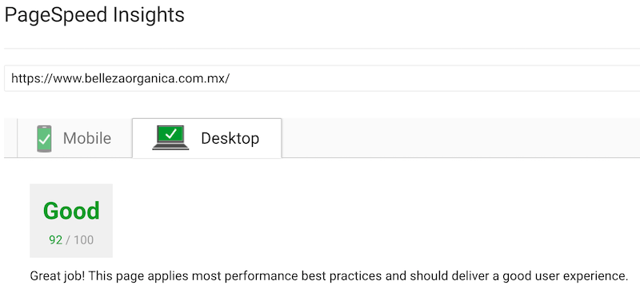
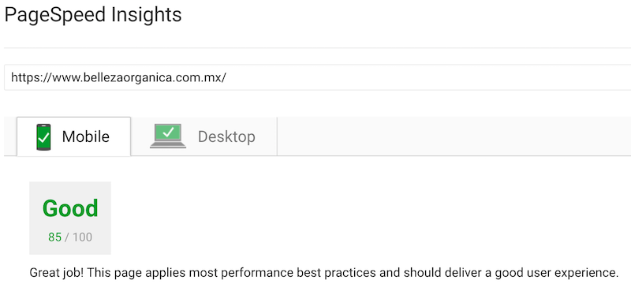

# Belleza Organica
> E-commerce website.

This repository is a production grade e-commerce website that I built for a client of mine. The backend is powered with ExpressJS, and the front-end is powered with ReactJS. The design was inspired by their previous website and improved on for a better user experience. You can view the production version of this website [here](https://bellezaorganica.com.mx/home).

## Table of Content
- [Development](#development)
	- [Database](#database)
	- [Frontend](#frontend)
	- [Backend](#backend)
- [Production](#production)
	- [Optimizations](#optimizations)
- [Usage](#usage)
- [License](#license)


## Development
I split the development process into three different stages. The first stage was to understand how the current data was beginning stored, e.g., SQL, NoSQL. After I had a grasp on my client's data, I began writing the frontend code. I started with the frontend code mostly because I wanted to have something to show. Once I finished the frontend, I started coding up the backend and at the same time made some improvements to the frontend.

### Database
The previous website was using a MySQL database with a simple e-commerce structure. My initial thought was to move the data into a NoSQL database mostly because I like the flexibility of a NoSQL database, but I decided to stick with MySQL. I did make some structural changes to optimize the performance of the database, the biggest of which was as follows.

The previous version used three tables to structure the categories. I thought that this was a bit redundant, so I changed the tables into just one self-referencing table. This way I could use a simple select query to get all the categories at once without having to use joins.

 -> 

### Frontend
For the frontend code, I used what I like to call the **React Stack**, which is ReactJS, Redux, React Router, and ImmutableJS. Along with a bunch of great npm packages, I was able to quickly develop a user-friendly UI. I split my code into two spread parts, Pages, and Components. The main difference between a Page and a Component, with the exception of the Layout and Loader Components, is that a Component is unaware of Redux.

#### Redux Store Structure
I structured the redux store accordingly because each object represents either a single row from a table or a collection of rows from a table.  I organized it like this so that whenever I fetch for a collection of objects, I only have to load the necessary data and not the entire object. For example loading a list of products only loads the product's name, price, and SKU instead of all of the product data.
```js
{
	categories: categoriesReducer,
	cart: cartReducer,
	products: productsReducer,
	product: productReducer,
	user: userReducer,
	others: othersReducer,
	codes: codesReducers,
	orders: ordersReducer,
	order: orderReducer,
	clients: clientsReducers,
	client: clientReducers,
	errors: errorsReducer,
	fetching: fetchingReducer
}
```

There are multiple reducer functions for each individual object and I used the reduce-reducers package to combine them into one.

#### Code Splitting With Webpack
To improve the initial load time I used Webpack's code splitting technic to create 4 chunks. The main chunk contains the most important information like the product's and category's pages, where a user would not be required to be logged in to view the content.


This chunk is part of the app where a user would have to be logged in to access. So the payments pages and the user's profile and the back-office for admin users.
```js
require.ensure([], function (require) {
	UserShow = require('pages/user/show').default
	CheckoutDirections = require('pages/checkout/directions').default
	CheckoutConfirmation = require('pages/checkout/confirmation').default
	CheckoutSuccessful = require('pages/checkout/successful').default
	OrderShow = require('pages/order/show').default
	BackofficeShow = require('pages/backoffice/show').default
})
```

This chunk is part of the payment gateway that I use. I could put this file with the previous chunk, but unfortunately, this throws an error when using server side rendering, so I had to require it from a different file that is not run on the server.
```js
require.ensure([], function (require) {
	require('utils/conekta.js')
})
```

This last chunk is all static components that are not essential to the web app, and they take up a lot of space, so I separated them into a different chunk to prioritize the main components/pages.
```js
require.ensure([], function (require) {
	QuienSomos = require('pages/others/quien_somos').default
	History = require('pages/others/history').default
	NuestraPro = require('pages/others/nuestra_pro').default
	PorqueOrganico = require('pages/others/porque_organico').default
	Terms = require('pages/others/terms').default
	Awards = require('pages/others/awards').default
	PasswordForgot = require('pages/password/forgot').default
	Stores = require('pages/store/stores').default
})
```

### Backend
For the backend code, I used ExpressJS to handle all the web requests and some rendering. For the view renderer, I used handlebars, but I only use it to render email templates and the initial index.html page. For rendering the actual web app I used React Server Side rendering, and for handling a user's session, I used JSON Web Tokens (JWT). The ORM that I use to connect to the MySQL database is Sequelize. Sequelize is one of the most popular ORM for NodeJS, and I found it very simple to use.

I structured the backend using the general MVC pattern, and I included middleware, and helpers for a little more organization, kind of like how a Rails app is structured. I used two types of controllers the API controllers and the view controllers. The main difference between these controllers is that one returns a rendered HTML string and the other only returns JSON object.

#### React Server Side
This simple helper function handles all of the React Server Side rendering. The only thing that changes with each request is the data and the URL. The only routes that are rendered with React are the ones found in the view_controllers folder. The one thing that they all have in common is that they are all accessible without a JSON Web Token, if a user tries to access a route where a JWT is required they will be redirect to the home page.

```js
module.exports = function (promises, map, url) {
	return Promise.all(promises).then(results => {
		let middleware = applyMiddleware(promise({promiseTypeSuffixes: ['LOADING', 'SUCCESS', 'ERROR']}))

		if(results[map['categories']]){
			results[map['categories']] = results[map['categories']].map(resu => resu.toJSON())
		}

		if(results[map['products']]){
			results[map['products']].rows = results[map['products']].rows.map(resu => resu.toJSON())
		}

		if(results[map['banners']]){
			results[map['banners']].rows = results[map['banners']].rows.map(resu => resu.toJSON())
		}

		if(results[map['product']]){
			results[map['product']] = results[map['product']].toJSON()
			results[map['product']].related = results[map['related']].map(resu => resu.toJSON())
		}

		const preloadState = Immutable.Record({
			categories: fromJS(results[map['categories']]),
			cart: undefined,
			products: fromJS(results[map['products']]),
			product: fromJS(results[map['product']]),
			user: undefined,
			others: fromJS({banners: results[map['banners']], mailing: {rows: [], count: 0}}),
			orders: undefined,
			codes: undefined,
			order: undefined,
			clients: undefined,
			client: undefined,
			errors: undefined,
			fetching: undefined
		})

		let store = createStore(getReducers(preloadState), middleware)
		const html = renderToString(
			<Provider store={store}>
			  <ServerRoutes url={url} />
			</Provider>
		)

		return {html: html, setWindow: `
      <script type="text/javascript">
      window.__PRELOADED_STATE__ = ${JSON.stringify( (new preloadState()).toJSON() ).replace(/</g, '\\u003c')}
      </script>
    `}
	})
}
```


## Production
For the frontend production build I used [webpack.config.production.js](webpack.config.production.js) config file to minify the CSS and Javascript, reducing the bundle from 1.34 MB to 444.25 KB. For the backend production build I also webpack but with a different config file [webpack.config.server.js](webpack.config.server.js). The difference between the server config file and the frontend config file is that the server file ignores all node_modules packages and doesn't use code spliting or css loaders. The final builds are then place in the build folder (server build) and public folder (frontend build).

### Optimizations
To optimize the page for a faster initial load speed I followed Google's [PageSpeed Insights](https://developers.google.com/speed/pagespeed/insights/) and got the following scores.

#### Desktop Score


#### Mobile Score


Unfortunately, I couldn't get a score of 100 mostly because Google also takes into account the social media feeds which reduce my score. Even so, I used GZIP to reduce the main bundle size from 444.24 KB to just 115 KB, which lead to an initial load time that is less than 1 sec on a 5mb/s network and with server side rendering I get less then 0.5s initial rendered DOM. I also used GraphicsMagick to optimize all the images on the site, and I used the picture tag to create an even better responsive experience.

### Hosting
I hosted the website on AWS, and I used Amazon's Elastic Beanstalk to simplify the process, which makes it a lot easier to quickly deploy a new version and downgrade a version if anything goes wrong. I saved all the images in an S3 bucket instead of web server mostly because of security, e.g., if a corrupt file somehow happens to be saved, it will not have access to the web server. The database is also hosted on AWS because it is straightforward to connect the database to the web server. I use Amazon builtin system alongside [PM2 Keymetrics](https://keymetrics.io/) to monitor the health of the application. For website analytics, I use the commonly known tool Google Analytics to get information about how the website is being used and find areas where I can improve the site.

## Usage
If you would like to contribute or just play around with the inner workings of the site you can follow the next steps

1. Fork the repo
2. Once your in the directory install the npm dependencies with `npm install`
3. Setting up the database. Checkout this file [here](backend/config/database.js) to see how the database is configured and checkout all the [models](backend/models/) to see what tables need to be created. Unfortunately, you will have to create the tables manually
4. Once the database is setup you can run the development server using `npm run server-dev`
5. Once the development server is running you can then run the frontend using `npm run dev`

## License
This work is licensed under the terms of the Apache License.
